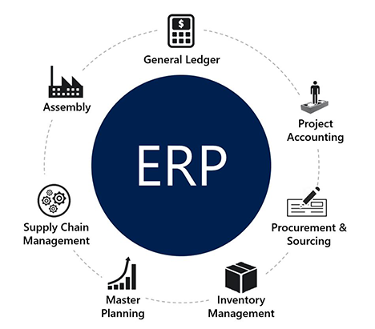
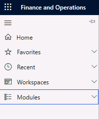
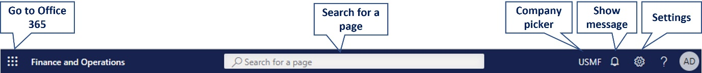
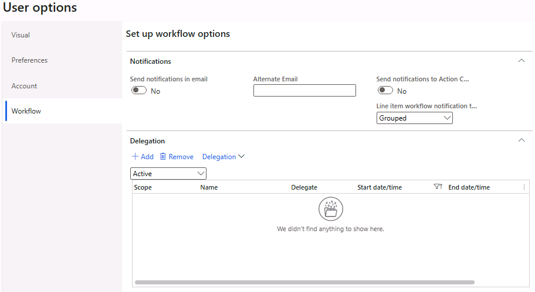
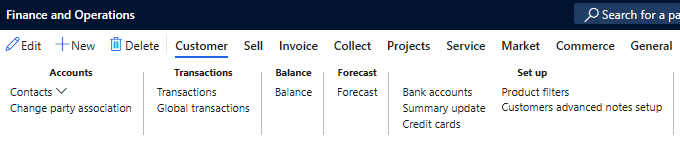
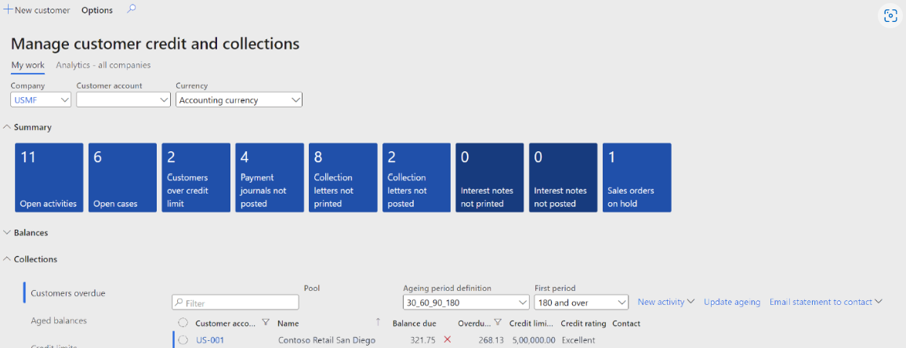

# MB-920: Dynamics 365 Fundamentals (ERP)

<https://learn.microsoft.com/en-us/credentials/certifications/exams/mb-920/>

## 1. Explore the core capabilities of Microsoft Dynamics 365 finance and operations apps

### 1-1. Describe the finance and operations apps

#### 1-1-2. Describe enterprise resource planning (ERP)

<https://learn.microsoft.com/en-us/training/modules/get-introduced-finance-operations-apps/2-discover-enterprise-resource-planning-erp>

- **ERP software**: ERP, stands for **E**nterprise **R**esource **P**lanning. A software that manages and integrates a company's core processes, such as finance, supply chain, operations, and human resources.
  - Fundamentally, ERP software enables you to run the core processes of a business.
    
- **Dynamics 365**: A set of intelligent business applications that work together seamlessly, providing CRM and ERP capabilities in the cloud.
- **Finance and operations apps**: A subset of Dynamics 365 applications that help businesses manage their global financial systems, operational business processes, and streamlined supply chains.
  - Dynamics 365 Supply Chain Management
  - Dynamics 365 Commerce
  - Dynamics 365 Human Resources
  - Dynamics 365 Project Operations
- **Business Central**: A business management solution for small and mid-sized organizations that automates and streamlines business processes within areas such as finance, manufacturing, sales, shipping, project management, and services.
  - Business Central vs finance and operations apps: BC can be for a single user, while FO requires at least 20 users. BC is also an all-in-one solution, while FO allows you to add the needed functionalities. FO in more complex and needs more configurations than BC.

#### 1-1-3. Describe finance and operations apps use cases

<https://learn.microsoft.com/en-us/training/modules/get-introduced-finance-operations-apps/3-describe-finance-operations-apps-use-cases>

- **Why use finance and operations apps**:
  - Limitations of current ERP system: Lack of capacity, lack of insight (real-time visibility), being costly to operate.
  - A Modern ERP system offers: scalability, help with human resource management, streamline project management needs, supply chain management, and integrated with AI and BI.

- **Cloud vs. on-premises implementation**:
  - Infrastructure (managed by Microsoft vs customer partner in a disconnected datacenter)
  - Data location (Microsoft vs local residency)
  - Data trustee
  - Application lifecycle management (managed by Microsoft vs customer)
  - Cloud capabilities (high availability included vs managed by customer).

#### 1-1-4. Finance and operations apps user interfaces

<https://learn.microsoft.com/en-us/training/modules/get-introduced-finance-operations-apps/4-describe-finance-operations-apps-user-interfaces>

- **Navigation pane**: The leftmost pane that allows users to access any page, such as favorites, recent, workspaces, and modules.

    
- **Navigation bar**: The uppermost title bar that has options such as go to Office 365, search for a page, company picker (**legal entity**), show messages, and settings.

    
- **User options**: A setting that enables users to configure user-specific preferences, such as visual, language, accessibility, workflow, and task recorder.
- **Action pane**: A control on a page that has buttons for basic actions, such as edit, new, delete, and save records.
- **Filters**: Four filtering options that help users to refine the data on a page, such as quick filter, filter pane, grid-column filter, and advanced filter or sort.
- **Workspaces**: Personalized work centers that provide 360-degree views of activities, insights, and direct access to tasks. There are three types of workspaces: analytical, mobile, and standard.

- **Task recorder**: Allows to record a business process, for different purposes like documenting (export as a word file), or automatic playback of a business process (save as a developer recording, XML Generated code is based on the SysTest Framework and FormAdaptors, which facilitate unit/component testing), also for regression testing aka Regression Suite Automation Tool (RSAT), which is fully integrated with DevOps for executing test cases.

- **Action Pane**:
The Action Pane is a control on a page. When you open a page, for example, the Customer page in the following screenshot, the topmost section of the page is the Action Pane.

- **Work Spaces**:
A workspace is a one-stop shop for specific activities. Think of workspaces as personalized work centers with data, reports, and transactions that increase efficiency. Workspaces can help drive productivity by:
  - Providing 360-degree views of activities
  - Answering specific questions such as coming invoice dues, ready-to-invoice purchases, number of active POS devices.
  - Providing insights (getting a big picture)
  - Navigating by data
  - Direct access to tasks

  

- **Analytical Workspaces**: A set of reports offering insights into standard business operations. Like a dashboard, and differs from financial reports. Can be embed with MS Power BI.

- **Mobile Workspaces**: Using the mobile app for some operations including Time sheet, Expense, and Advanced Warehouse. It can work offline.

#### 1-1-5. Exercise: Navigate the finance and operations apps

<https://learn.microsoft.com/en-us/training/modules/get-introduced-finance-operations-apps/5-exercise-navigate-finance-operations-apps>

**TODO**

#### 1-1-6. Knowledge Check and Summary

<https://learn.microsoft.com/en-us/training/modules/get-introduced-finance-operations-apps/7-summary>

Now that you have reviewed this module, you should be able to:

- Describe enterprise resource planning (ERP).
- Describe use cases for finance and operations apps.
- Describe the finance and operations apps user interfaces.

### 1-2. Describe reporting and integration capabilities in finance and operations apps

## 2. Learn the fundamentals of Microsoft Dynamics 365 Finance

### 2-1. Describe Dynamics 365 Finance core capabilities

### 2-2. Describe the general ledger in Dynamics 365 Finance

### 2-3. Describe accounts payable and accounts receivable in Dynamics 365 Finance

### 2-4. Explore expense management, fixed asset management, and budgeting in Dynamics 365 Finance

## 3. Learn the fundamentals of Microsoft Dynamics 365 Supply Chain Management

### 3-1. Describe the general capabilities of Dynamics 365 Supply Chain Management

### 3-2. Describe warehouse and inventory management capabilities in Dynamics 365 Supply Chain Management

### 3-3. Describe manufacturing strategies in Dynamics 365 Supply Chain Management

## 4. Learn the fundamentals of Microsoft Dynamics 365 Commerce

### 4-1. Describe Dynamics 365 Commerce capabilities

### 4-2. Describe Dynamics 365 Commerce clienteling capabilities and Dynamics 365 Fraud Protection

## 5. Learn the fundamentals of Microsoft Dynamics 365 Human Resources

### 5-1. Describe Dynamics 365 Human Resources core capabilities

### 5-2. Describe personnel management capabilities in Dynamics 365 Human Resources

## 6. Learn the fundamentals of Microsoft Dynamics 365 Project Operations

### 6-1. Identify project life cycle management capabilities in Dynamics 365 Project Operations

### 6-2. Describe the project planning and execution capabilities of Dynamics 365 Project Operations
